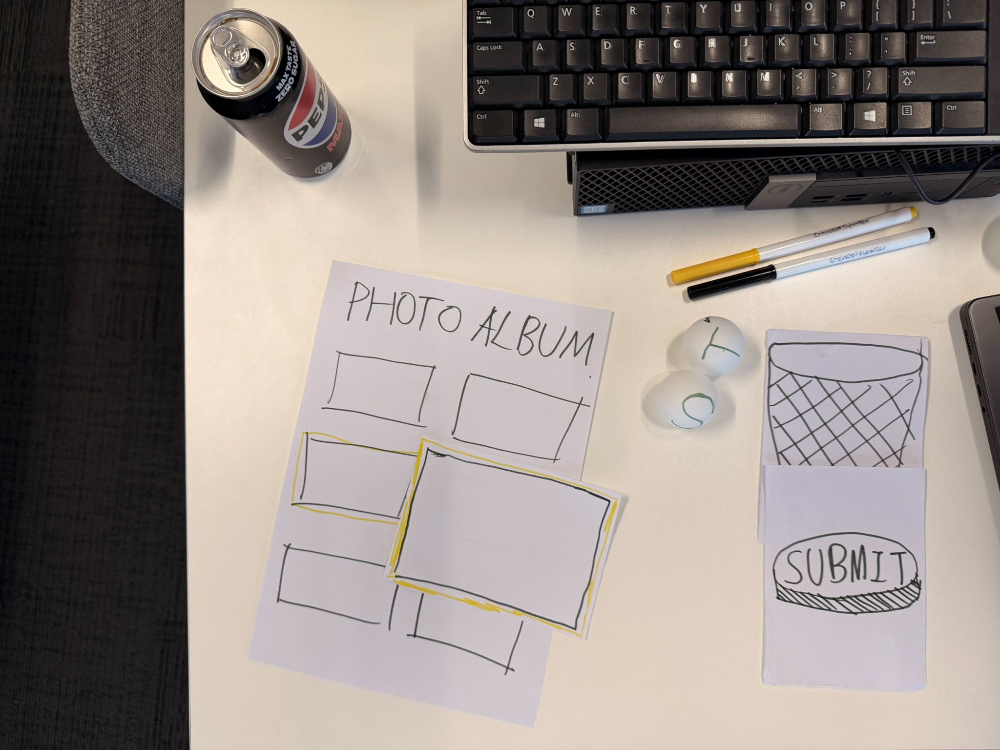
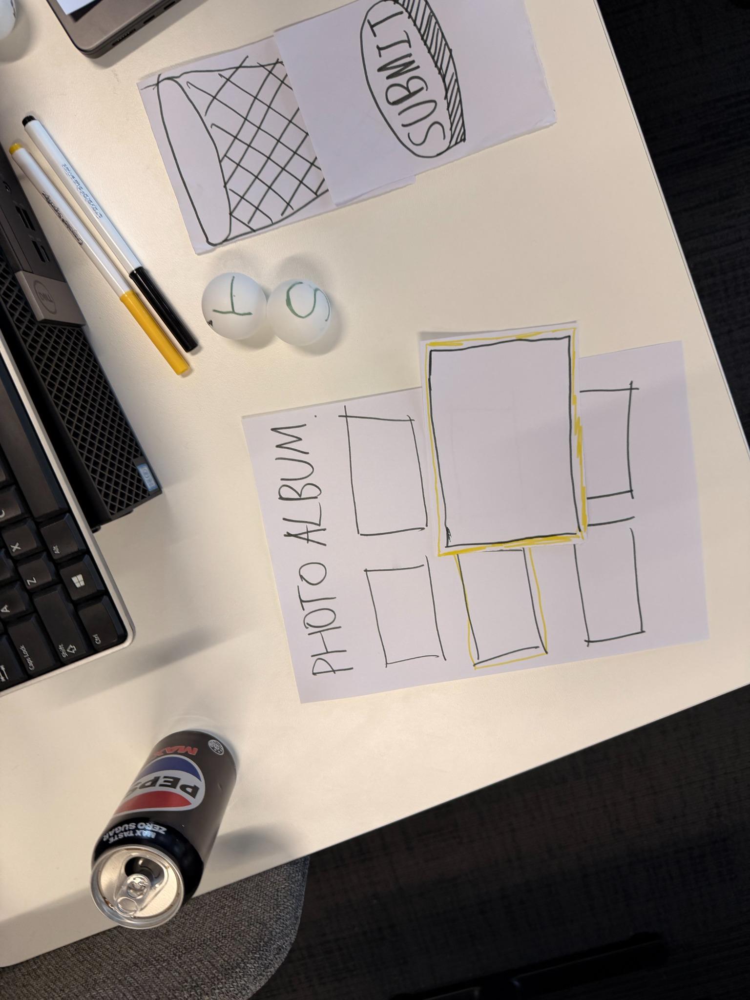
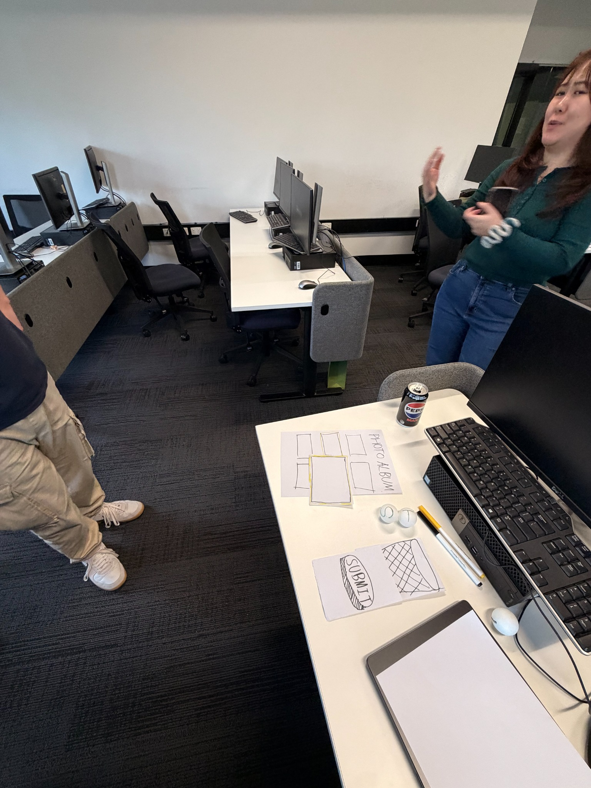
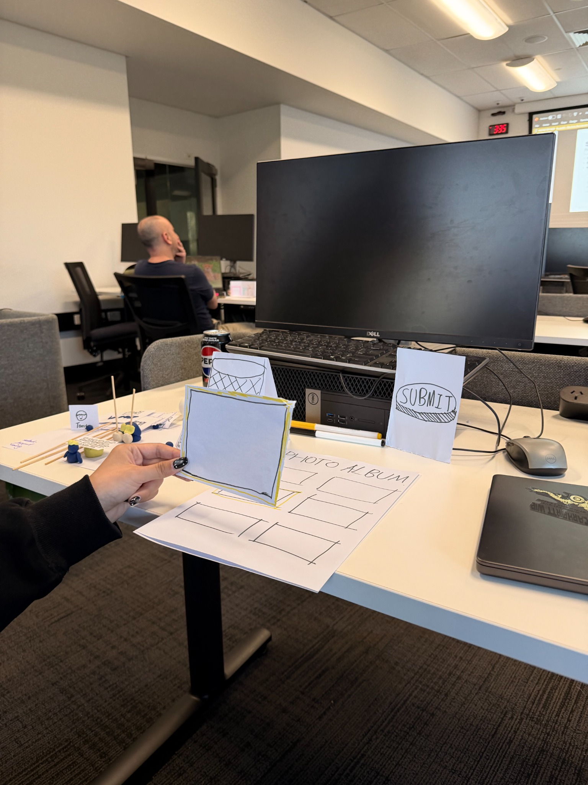

# Instagram Story in Mixed Reality

## DECO2300/7230 Digital Prototyping and Extended Reality  
**Design Concept – Week 2 to Week 3**

## Concept Overview

This project redesigns the **Instagram Story creation feature** as a **Mixed Reality (MR)** experience.

Instead of using a flat mobile screen, users can see photos and videos from their album floating in front of them. They can select, grab, enlarge, edit, delete, and publish story content using hand gestures and spatial interaction.

The goal is to make Story creation feel more direct, physical, and immersive.

---

## User Tasks and Goals

### 1. Browse and select media
Users see photos and videos from their album floating in front of them. When they select an item, it is highlighted.

**Goal:** Help users quickly find and choose content for a Story.

### 2. Inspect and organise content
Users can grab a selected photo or video. The content becomes larger in their field of view so they can inspect details. A pinch gesture can reduce it again.

**Goal:** Let users check media clearly before adding it to the Story.

### 3. Add text and stickers
Two floating spheres appear after media is selected:
- **T** = Text
- **S** = Stickers

Users can choose one of the tools and place text or stickers directly onto the Story content.

**Goal:** Make editing more expressive through spatial interaction.

### 4. Remove and publish
Unwanted content can be thrown into a virtual trash bin on the left side. When editing is complete, a large red **Submit** button appears and users can hit it to publish the Story.

**Goal:** Make deleting and publishing simple and easy to understand.

---

## Week 2 – Low-Fidelity Prototyping

A paper prototype was created during the Week 2 Studio activity to explore how the Story interface could work in XR.

The prototype included:

- a floating **Photo Album**
- a highlighted selected photo
- two floating editing tools for **Text** and **Stickers**
- a virtual **trash bin**
- a large **Submit** button

### Prototype Overview

### Prototype Top View

### Play-Acting the Interaction

### Simulating Grab Interaction

---

## Interaction Flow

1. Enter Instagram Story mode in MR.
2. Photos and videos from the album appear as floating cards.
3. Select media by pointing or reaching toward it.
4. The selected item becomes highlighted.
5. Grab the item to enlarge it in the centre of the user's view.
6. Move the head or body to inspect the content.
7. Use a pinch gesture to minimise it.
8. Select the **Text** or **Sticker** sphere to edit the Story.
9. Drag or place text and stickers onto the content.
10. Throw unwanted content into the trash bin.
11. Hit the large red **Submit** button to publish the Story.

---

## Week 3 – Concept Refinement

The first idea was mainly a floating version of the Instagram album. After making and acting out the paper prototype, the concept was refined to use more spatial and embodied XR interactions.

### Refinements

- **Selection feedback:** A yellow border was added so users can clearly see which media item is selected.
- **Direct manipulation:** Users can physically grab media instead of opening it through a normal 2D menu.
- **Immersive inspection:** Selected media becomes larger so users can inspect details by moving their head and body.
- **Spatial editing tools:** Text and sticker functions were changed into floating tool spheres.
- **Physical deletion:** Unwanted content can be thrown into a trash bin.
- **Physical publishing:** The final action uses a large Submit button that users can hit.

These changes make the concept more suitable for XR instead of simply moving the existing mobile interface into a headset.

---

## Target XR Environment

The concept targets a **room-scale Mixed Reality environment with hand tracking**.

The user can still see the physical room while digital Story content appears around them.

### Main XR Interactions

- hand selection
- grabbing
- pinch gestures
- two-handed scaling
- spatial dragging
- physical throwing
- head and body movement
- direct placement of text and stickers
- striking a large virtual button

---

## Initial Testing Plan

The first prototype test will focus on whether users understand the main interactions without detailed instructions.

| Interaction to Test | Assumption | Data to Collect |
|---|---|---|
| Select and grab a photo | Users will understand that highlighted media can be grabbed | Task success, completion time, errors |
| Enlarge and minimise media | Grab and pinch gestures will feel natural | Success rate, prompts needed, user comments |
| Use Text and Sticker spheres | Users will understand what the T and S spheres mean | Errors, hesitation, think-aloud comments |
| Throw media into the trash bin | Physical throwing will feel intuitive for deletion | Success rate, wrong actions, ease rating |
| Hit Submit to publish | Users will recognise the large red button as the final publishing action | Completion rate, hesitation time, confidence rating |

### Planned Data

- task completion rate
- completion time
- number of errors
- number of prompts needed
- think-aloud comments
- observation notes
- ease-of-use rating
- short interview feedback

---

## Current Concept Status

The concept has moved from an initial floating album idea to a more complete MR Story creation flow based on direct manipulation and spatial interaction.

The next step is to prototype the key interactions in XR and test whether users can understand them naturally.
